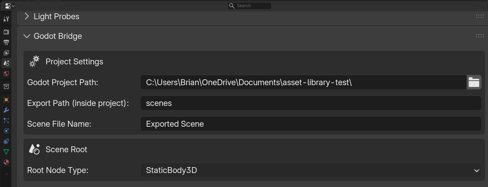

Skip to content

    hoverbox
    Godot-Bridge

Repository navigation

    Code
    Issues
    Pull requests
    Actions
    Projects
    Security
    Insights
    Settings

    Godot-Bridge

/
in
main

Indent mode
Indent size
Line wrap mode
Editing README.md file contents
 67
 68
 69
 70
 71
 72
 73
 74
 75
 76
 77
 78
 79
 80
 81
 82
 83
 84
 85
 86
 87
 88
 89
 90
 91
 92
 93
 94
 95
 96
 97
 98
 99
100
101
102
103
104
105
106
107
108
109
110
111
112
113
114
115
116
117
118
119
120
121
122
123
124
125
126
127
128
129
130
131
132
133
134
135
136
137
138
139
140
141
142
| `CollisionShape3D` | Collision shape derived from this mesh. Invisible in Godot. |
| `Node3D` | Plain transform node. |
| `Marker3D` | Empty transform marker. |
| *(+ many more)* | Full dropdown includes lights, cameras, audio, particles, navigation, etc. |

### Collision Shape Type

Shown when an object is tagged as `CollisionShape3D`.

| Shape | Description |
|---|---|
| `Trimesh` | `ConcavePolygonShape3D` — exact triangle mesh. Best for static terrain and walls. **StaticBody3D / Area3D only.** |
| `Convex Hull` | `ConvexPolygonShape3D` — convex hull. Works with all body types including `RigidBody3D`. |
| `Box` | `BoxShape3D` from bounding box. |
| `Sphere` | `SphereShape3D` from bounding box. |
| `Capsule` | `CapsuleShape3D` from bounding box. |
| `Cylinder` | `CylinderShape3D` from bounding box. |

---

## Scene Panel

**Properties → Scene → Godot Bridge**

| Setting | Description |
|---|---|
| Godot Project Path | Path to the folder containing `project.godot` |
| Export Path | Subfolder inside the project, e.g. `scenes` or `assets/props` |
| Scene File Name | Name for the `.tscn` file, without extension |
| Scene Root Node Type | Godot node type for the scene root — `Node3D`, `StaticBody3D`, `CharacterBody3D`, `Area3D`, etc. |

The **Tagged Objects** list shows a live summary of everything that will be exported before you click the button.

---

## Example Setups

### Static Physics Object
```
WoodCrate              ← scene root: StaticBody3D
  CrateMesh            ← MeshInstance3D
  CrateCollision       ← CollisionShape3D [Convex Hull]
```

### Trigger Volume
```
DoorTrigger            ← scene root: Node3D
  TriggerArea          ← Area3D
    TriggerShape       ← CollisionShape3D [Box]
```

### Character
```
Player                 ← scene root: CharacterBody3D
  PlayerMesh           ← MeshInstance3D
  PlayerCollision      ← CollisionShape3D [Capsule]
```

### Level / Environment
```
Level1                 ← scene root: Node3D
  FloorMesh            ← MeshInstance3D
  FloorCol             ← CollisionShape3D [Trimesh]
  Wall_A               ← StaticBody3D
    WallMesh_A         ← MeshInstance3D
    WallCol_A          ← CollisionShape3D [Trimesh]
```

---

## Tips

- **Keep collision meshes simple.** Use Box or Convex Hull for most objects. Reserve Trimesh for large static geometry like terrain.
- **Trimesh is StaticBody3D / Area3D only.** It won't work correctly with `RigidBody3D` — use Convex Hull instead.
- **Object names in Blender become node names in Godot.** Name things clearly.
- **Re-export any time you change geometry or hierarchy.** All files are fully overwritten.
Use Control + Shift + m to toggle the tab key moving focus. Alternatively, use esc then tab to move to the next interactive element on the page.
Attach files by dragging & dropping, selecting or pasting them.
Editing Godot-Bridge/README.md at main · hoverbox/Godot-Bridge